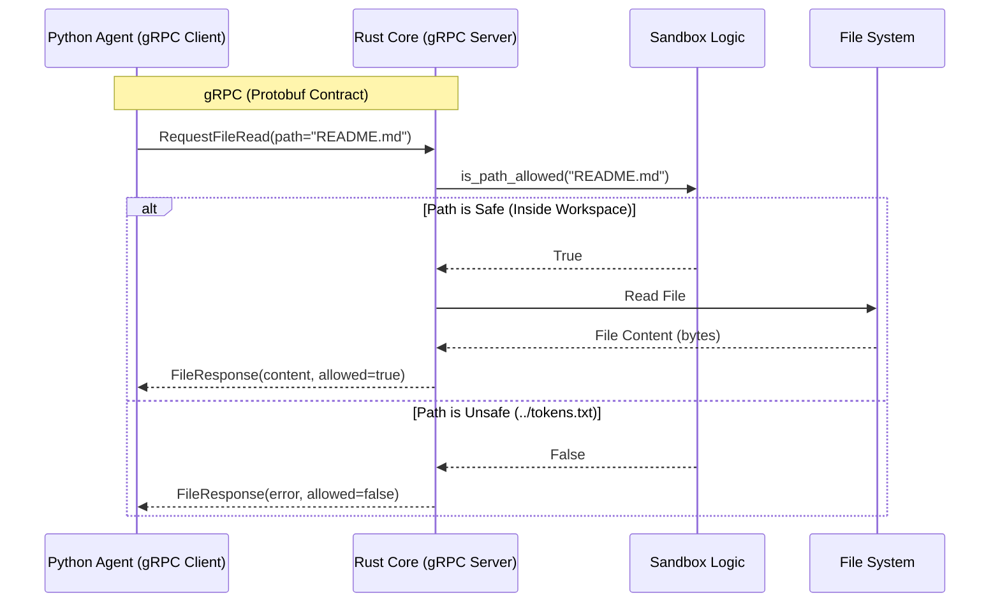
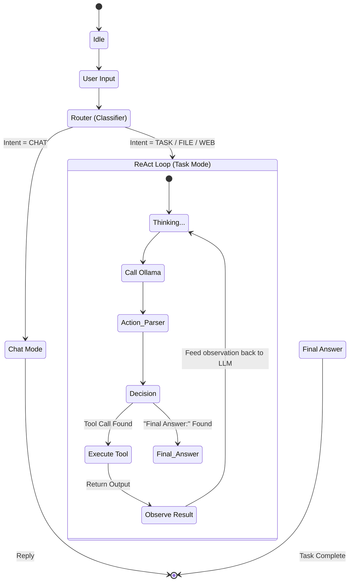
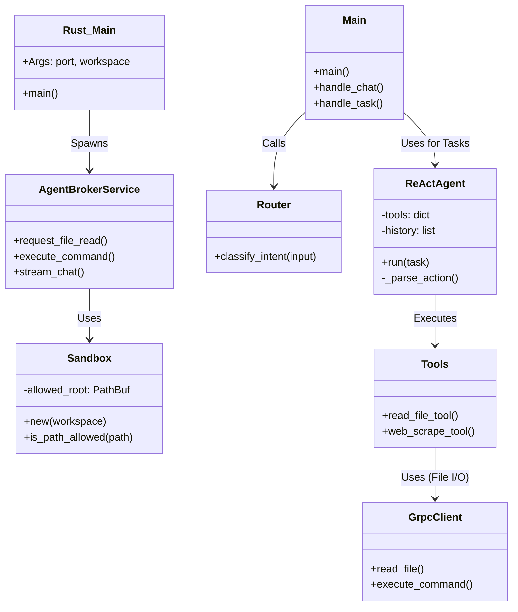

# Ageis Agent Architecture Map (Phase 1 & 2)

이 문서는 **Phase 1 (The Body)** 와 **Phase 2 (The Brain)** 의 전체 구조와 데이터 흐름을 시각화합니다.

## 1. 전체 시스템 개요 (The Big Picture)

Rust 코어(보안/시스템)와 Python 에이전트(지능/로직)가 **gRPC**로 연결된 구조입니다.

```mermaid
graph TD
    subgraph "External World"
        User((User))
        Web[Web Sites]
    end

    subgraph "Ageis System"
        subgraph "Python Agent (The Brain)"
            Router[Router<br/>(의도 분류)]
            ReAct[ReAct Loop<br/>(추론/행동)]
            Tools[Tools Wrapper]
        end

        subgraph "Rust Core (The Body)"
            gRPC_Server[gRPC Server<br/>(AgentBroker)]
            Sandbox[Sandbox<br/>(Path Verification)]
        end
        
        LLM[Ollama Local LLM<br/>(Llama 3.2)]
    end

    subgraph "File System"
        Workspace[Agent_Workspace]
        Forbidden[System Files<br/>(Access Denied)]
    end

    %% Connections
    User -->|Command/Chat| Router
    Router -->|Simple Chat| LLM
    Router -->|Complex Task| ReAct
    
    ReAct <-->|Prompt/Response| LLM
    ReAct -->|Call Tool| Tools
    
    Tools -->|Scrape| Web
    Tools <-->|gRPC Request| gRPC_Server
    
    gRPC_Server -->|Check Path| Sandbox
    Sandbox -- Allowed --> Workspace
    Sandbox -- Denied --> Forbidden
```

---

## 2. Phase 1: 튼튼한 뼈대 (Communication & Security)

**Rust Core**가 Python의 요청을 받아 **보안 검사(Sandbox)** 후 파일 시스템에 접근하는 흐름입니다.



---

## 3. Phase 2: 깨어난 지능 (Reasoning Loop)

**Python Agent**가 사용자의 복잡한 명령을 **생각(Thought)하고 행동(Action)** 하는 과정입니다.



---

## 4. 컴포넌트 상세 (Class/Module View)

주요 클래스와 모듈의 역할입니다.


