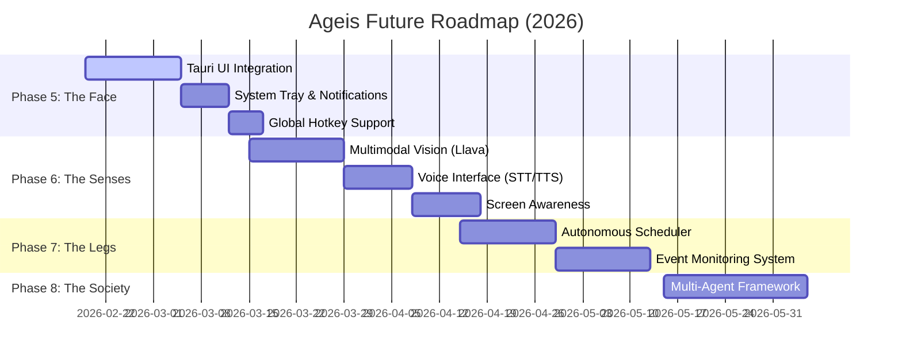

# Ageis Agent Development Roadmap (Future Vision)

> **작성일:** 2026-02-18
> **현재 상태:** Phase 4 완료 (CLI/Web UI 구축)
> **비전:** "단순한 챗봇을 넘어, 운영체제와 깊이 통합된 지능형 파트너(Intelligent OS Companion)로 진화한다."

---

## 📅 전체 타임라인 (Timeline)

---

## 🚀 상세 전략 (Detailed Strategy)

### Phase 5: The Face (Tauri 데스크톱 앱 통합)
**목표:** 웹 브라우저를 벗어나, OS의 일부분처럼 자연스럽게 작동하는 Native App 경험 제공.

1.  **아키텍처 전략: Sidecar Pattern**
    *   **구조:** Tauri(Rust 메인 프로세스)가 실행될 때, `python_agent`를 서브 프로세스(Sidecar)로 함께 실행합니다.
    *   **통신:**
        *   **UI 이벤트:** Tauri Frontend(React/SolidJS) ↔ Python Agent (WebSocket)
        *   **시스템 제어:** Tauri Backend(Rust) ↔ Python Agent (gRPC/Stdout)
    *   **배포:** `pyinstaller`로 Python 에이전트를 단일 실행 파일로 패키징하여 Tauri 앱에 포함 배포.

2.  **OS 통합 기능:**
    *   **글로벌 단축키 (예: Alt+Space):** 언제든 에이전트를 호출하여 명령 수행.
    *   **시스템 트레이:** 백그라운드 상주, 알림 수신.
    *   **네이티브 파일/폴더 드래그 앤 드롭:** 파일 경로를 바로 인식.

### Phase 6: The Senses (멀티모달 확장)
**목표:** 텍스트뿐만 아니라 시각(Vision)과 청각(Voice)을 통해 세상을 인식.

1.  **Vision (눈)**
    *   **전략:** `ollama list`에 `llava` 모델 추가.
    *   **기능:** 사용자가 업로드한 이미지나 클립보드의 스크린샷을 분석.
    *   **시나리오:** "이 에러 메시지 캡처한 거 해석해줘", "이 UI 디자인 코드로 바꿔줘".

2.  **Voice (귀와 입)**
    *   **전략:** 로컬 Whisper(STT) + OS Native TTS 또는 Piper(Local TTS).
    *   **기능:** "헤이, 에이지스"로 호출(Wake Word) 및 음성 대화.
    *   **인터페이스:** Web UI에 마이크 버튼 추가, WebSocket으로 오디오 스트림 전송.

### Phase 7: The Legs (자율성 및 스케줄링)
**목표:** 사용자가 시키지 않아도 알아서 할 일을 찾고 수행.

1.  **Scheduler (시간 기반)**
    *   **전략:** `APScheduler` 도입.
    *   **시나리오:** "매일 아침 9시에 주식 시장 요약해줘", "매주 금요일에 주간 업무 보고서 초안 작성해줘".

2.  **Event Monitor (이벤트 기반)**
    *   **전략:** 파일 시스템 감시(`watchdog`), 시스템 로그 모니터링.
    *   **시나리오:** "Downloads 폴더에 PDF 파일이 생기면 자동으로 요약해서 내 문서로 이동시켜줘".

### Phase 8: The Society (멀티 에이전트 협업)
**목표:** 한 명의 천재가 아닌, 전문가 팀을 운영.

1.  **Specialized Agents**
    *   **Manager:** 사용자 의도를 파악하고 업무 분배 (현재 Router의 진화형).
    *   **Coder:** 코드 작성/리팩토링 전문 (깊은 문맥 이해).
    *   **Researcher:** 웹 검색 및 정보 종합 전문.
    *   **Writer:** 창의적 글쓰기 및 교정 전문.

2.  **Collaboration Protocol**
    *   에이전트 간 메시지 교환 표준 정의 (Actor Model).
    *   공동 작업 공간(Shared Context) 활용.

---

## 🛠️ 기술적 고려사항 (Technical Notes)

*   **로컬 우선 (Local-First):** 모든 AI 모델(LLM, Vision, STT/TTS)은 로컬 구동을 원칙으로 하여 프라이버시를 보장합니다.
*   **성능 최적화:** Python 에이전트가 무거워질 수 있으므로, 핵심 연산(벡터 검색 등)은 Rust로 이관하거나 최적화가 필요합니다.
*   **보안 강화:** 에이전트 권한이 강력해질수록(OS 제어), `sandbox.rs`의 정책을 더욱 세밀하게 다듬어야 합니다. (사용자 승인 절차 필수화)

이 로드맵은 Ageis가 단순한 도구를 넘어 **"신뢰할 수 있는 디지털 동료"** 가 되는 길입니다. 🚀
